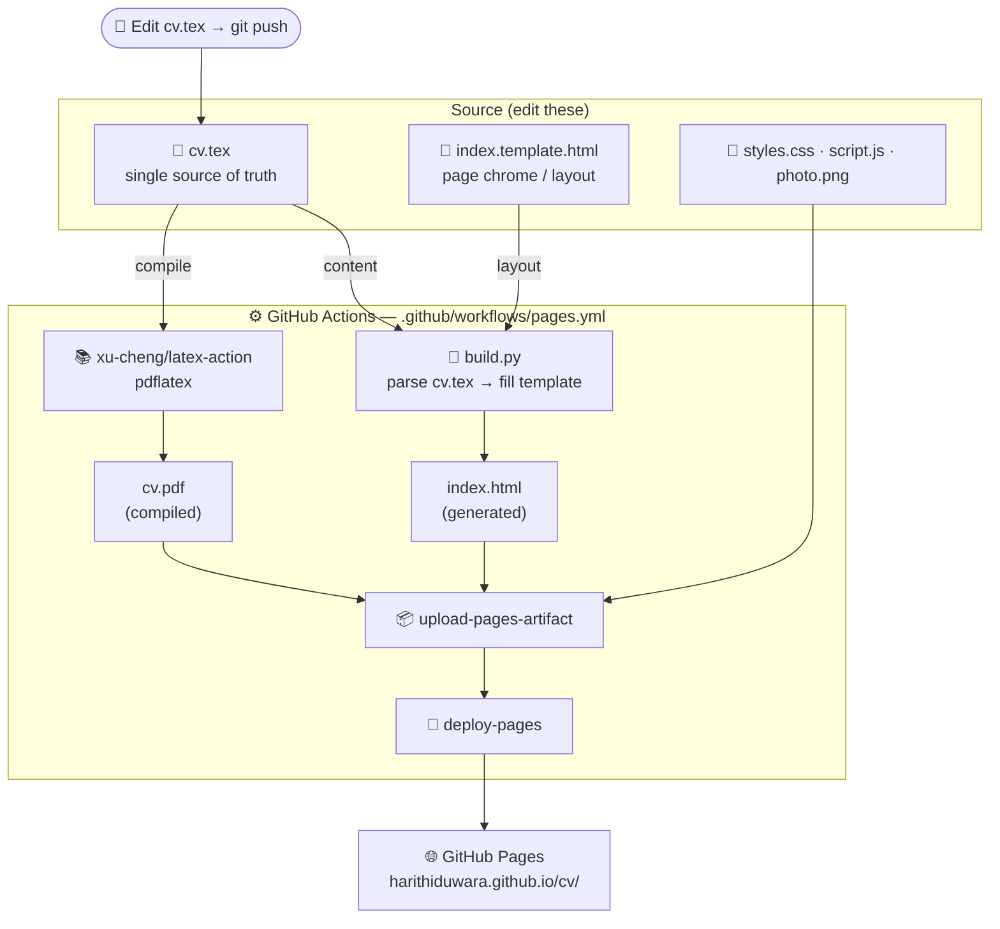

# CV

Personal CV website for **Harith Iduwara** — a responsive single-page site
(HTML/CSS/JS, light & dark themes) with an auto-compiled PDF, all generated
from one source file.

**Live:** https://harithiduwara.github.io/cv/ &nbsp;·&nbsp; **PDF:** https://harithiduwara.github.io/cv/cv.pdf

---

## Architecture

`cv.tex` is the **single source of truth**. On every push to `main`, GitHub
Actions generates the styled website *and* compiles the PDF from it, then
publishes both to GitHub Pages — so editing only `cv.tex` updates everything.



### Flow

1. **Edit `cv.tex`** and push to `main`.
2. **`build.py`** parses `cv.tex` (name, contact links, experience, skills,
   education, projects, achievements) and injects the content into
   `index.template.html` to produce **`index.html`**.
3. **`xu-cheng/latex-action`** runs `pdflatex` to compile `cv.tex` into
   **`cv.pdf`**.
4. The generated `index.html`, `cv.pdf`, and static assets are uploaded and
   **deployed to GitHub Pages**.

## Files

| File | Role |
|------|------|
| `cv.tex` | **Source of truth** — CV content (LaTeX). Edit this. |
| `build.py` | Parses `cv.tex` and fills the template → `index.html`. |
| `index.template.html` | Page shell/chrome (nav, hero headline, theme toggle). |
| `styles.css` / `script.js` | Styling and interactions (theme, reveal, nav). |
| `photo.png` | Headshot (used by the site and the PDF). |
| `.github/workflows/pages.yml` | CI: generate → compile → deploy. |
| `index.html`, `cv.pdf` | **Generated** in CI (git-ignored). |

## Editing cv.tex

Keep entries in the existing style and both the site and PDF update themselves:

- **Experience** — `\item \textbf{Title} \hfill Dates \\ \textit{Company}, Location`, then a nested `itemize` of sub-roles/bullets, then `\small{\textbf{Technologies:} ...}`
- **Projects** — `\resumeSubItem{Name}{Description}`
- **Education** — `\resumeSubheading{School}{Location}{Degree}{Dates}`
- **Skills** — `\item \textbf{Category:} item, item, item`
- **Achievements** — `\item Text | Year`

## Local preview

```bash
python build.py      # regenerate index.html from cv.tex
open index.html      # (PDF is produced in CI; compile locally with pdflatex if needed)
```
